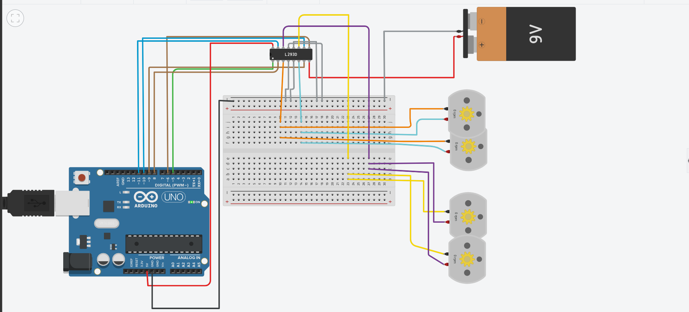

# 🌟 QuadServo Controller 🌟
### ⚡ Multi-Servo Precision Coordination System with Arduino Uno ⚡

---

## 📌 📖 Project Overview
The QuadServo Controller project is an advanced multi-channel actuation system designed to coordinate four independent servo motors simultaneously. Utilizing an Arduino Uno microcontroller, the system executes a meticulously timed sequence that transitions smoothly from dynamic continuous sweeping motion into a rigid, stable holding state. This demonstrates precise PWM signal generation, multi-axis synchronization, and non-blocking time management in embedded systems.

---

## 🎯 ⚡ Operational Logic & Core Requirements
The project execution is structured into two distinct, sequential phases managed autonomously by the control algorithm:

1. 🔄 Phase 1: Dynamic Sweep Routine
   * Behavior: All four servo motors initiate a continuous, synchronized back-and-forth oscillation sweeping across a full angular range from 0° to 180°.
   * Duration: This sweeping sequence runs continuously and precisely for an exact time window of 2 seconds using advanced time-tracking functions (`millis()`).

2. 🛑 Phase 2: Stabilization & Hold State
   * Behavior: Immediately upon the expiration of the 2-second interval, all motors break out of the oscillation loop.
   * Position: Every servo motor pivots instantly and locks firmly into a precise position of 90 degrees, maintaining this stable orientation indefinitely.

---

## 🌐 🔗 Live Tinkercad Simulation
You can explore, test, and run the live circuit simulation directly in your browser via the official Tinkercad workspace:

👉 [Click Here to Access the Tinkercad Circuit Simulation](https://www.tinkercad.com/things/ctzSRxtCs6N-quadservo-controller?sharecode=4C30DhzPooZ0-n_Og-TwS8SJfq4B8n_BDO4_eZQj74s)

---

## 🛠️ 🔌 Hardware Architecture & Pin Mapping

| Component | Pin / Interface | Functional Role |
| :--- | :--- | :--- |
| 🧠 Arduino Uno | Microcontroller Board | Central processing and logic execution unit |
| ⚙️ Servo Motor 1 | Digital Pin 9 (PWM) | Independent angular drive channel 1 |
| ⚙️ Servo Motor 2 | Digital Pin 10 (PWM) | Independent angular drive channel 2 |
| ⚙️ Servo Motor 3 | Digital Pin 11 (PWM) | Independent angular drive channel 3 |
| ⚙️ Servo Motor 4 | Digital Pin 6 (PWM) | Independent angular drive channel 4 |
| 🔋 Power Bus | Breadboard (5V & GND) | Distributed power rail ensuring stable current delivery |

---

## 🚀 💡 Technical Highlights & Engineering Benefits
* Multi-Channel Synchronization: Achieves uniform response times across four distinct physical channels without jitter or latency lag.
* Temporal Control: Implements time-based boundaries (`millis()`) rather than rigid delay loops, ensuring scalable program flow.
* Modular Reliability: Separates the active sweeping routine from the steady-state holding protocol, ensuring fail-safe positioning upon completion.

---

  <h3>📺 Circuit Diagram & Simulation Preview</h3>
   
  
  <!-- Displays the circuit image -->
  
  

